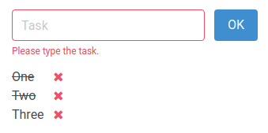

# alpinejs-example

Todo list made with [Alpine.js](https://alpinejs.dev/)


## json-server

https://github.com/typicode/json-server


### Installation

```
npm install -g json-server
```

Create a `db.json`

```json
{
  "todos": [
    {
      "task": "One",
      "id": 1
    },
    {
      "task": "Two",
      "id": 2
    },
    {
      "task": "Three",
      "id": 3
    }
  ],
  "products": [
    {
      "title": "Refrigerante",
      "price": 6.35,
      "id": 1
    },
    {
      "title": "Suco de laranja",
      "price": 8.99,
      "id": 2
    },
    {
      "title": "Caldo de cana",
      "price": 5,
      "id": 3
    },
    {
      "title": "Pastel",
      "price": 7,
      "id": 4
    },
    {
      "title": "Coxinha",
      "price": 5.5,
      "id": 5
    }
  ],
  "sales": [
  ]
}
```

Run Json Server

```
json-server --watch db.json
```

## http-server

https://github.com/http-party/http-server

```
npm install --global http-server

http-server [path] [options]
```


